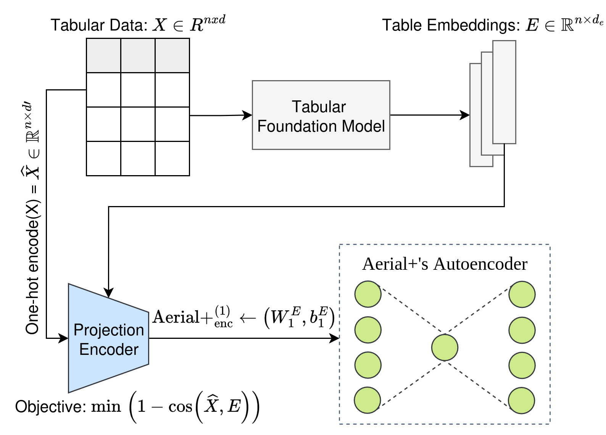
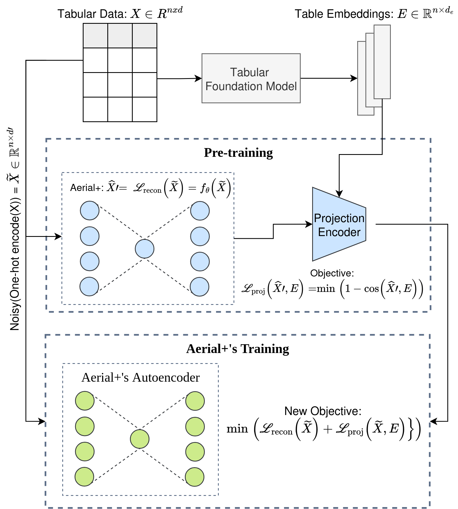

# Configuration and Troubleshooting

> Looking for parameter tuning (thresholds, epochs, architecture, rule count/quality)? That all lives in the
> [Parameter Tuning Guide](parameter_guide.md).

## GPU Usage

The `device` parameter in `train()` can be used to run Aerial on GPU. Note that Aerial only uses a shallow Autoencoder
and therefore can also run on CPU without a major performance hindrance.

Furthermore, Aerial will also use the device specified in `train()` function for rule extraction, e.g., when performing
forward runs on the trained Autoencoder with the test vectors.

```python
from aerial import model, rule_extraction
from ucimlrepo import fetch_ucirepo

# a categorical tabular dataset
breast_cancer = fetch_ucirepo(id=14).data.features

# run Aerial on GPU
trained_autoencoder = model.train(breast_cancer, device="cuda")

# during the rule extraction stage, Aerial will continue to use the device specified above
result = rule_extraction.generate_rules(trained_autoencoder)
print(f"Mined {result['statistics']['rule_count']} rules on GPU")
```

## Logging Configuration

Aerial source code prints extra debug statements notifying the beginning and ending of major functions such as the
training process or rule extraction. The log levels can be changed as follows:

```python
import logging
import aerial

# setting the log levels to DEBUG level
aerial.setup_logging(logging.DEBUG)
...
```

## Using a Custom Autoencoder

The `autoencoder` parameter of `train()` accepts your own Autoencoder implementation, as long as the last layer
matches the original version (see the [paper](https://proceedings.mlr.press/v284/karabulut25a.html) or the source code).

> **Note:** PyAerial trains with a **masking** objective — each batch randomly corrupts a subset of features to a
> uniform "unknown" distribution and the Autoencoder learns to reconstruct them from the remaining unmasked features
> (bounded by `min_unmasked_features`/`max_unmasked_features`). This replaces the Gaussian-noise-based denoising of the
> original [Aerial+ paper](https://proceedings.mlr.press/v284/karabulut25a.html) — see
> [How Aerial Works](research.md) for details.

## Getting Help

If Aerial produces error messages, please create an issue in the
[GitHub repository](https://github.com/DiTEC-project/pyaerial/issues) with the error message.

For tuning problems ("no rules", "too many rules", "takes too long"), see
[When Things Don't Work](parameter_guide.md#when-things-dont-work) in the Parameter Tuning Guide.

## Advanced: Boosting Rule Quality with Tabular Foundation Models

For domains with limited data—such as gene expression datasets with thousands of features but only dozens of
samples—traditional rule mining algorithms struggle to discover meaningful patterns. Aerial addresses this challenge by
enabling **transfer learning in knowledge discovery**, a paradigm shift from conventional algorithmic methods like
Apriori, FP-Growth, and ECLAT that inherently lack this capability.

### The Challenge: High-Dimensional Small Tabular Data

In specialized domains (biomedical research, rare disease analysis, materials science), practitioners often face extreme
dimensional imbalance where the number of features far exceeds available samples. Classical ARM algorithms fail in these
settings because they cannot leverage knowledge from related domains. Aerial overcomes this limitation by incorporating
tabular foundation models—neural networks pre-trained on diverse tabular datasets—that transfer learned representations
to discover high-quality rules even from scarce data.

### Transfer Learning Strategies in Aerial

Aerial supports two fine-tuning strategies to adapt foundation models for rule mining:

#### 1. Weight Initialization (WI)



The foundation model's pre-trained weights initialize Aerial's autoencoder, preserving learned feature relationships
while adapting to the specific rule mining task. This strategy enables the model to leverage patterns from large-scale
pre-training while specializing for the target domain.

#### 2. Projection-Guided Fine-Tuning via Double Loss (DL)



This strategy uses a projection encoder to align Aerial's autoencoder reconstructions with embeddings from a tabular
foundation model (e.g., TabPFN), jointly optimizing two complementary objectives:

- **Reconstruction loss (L_recon)**: Binary cross-entropy loss ensuring the autoencoder accurately reconstructs the
  original tabular data
- **Projection loss (L_proj)**: Cosine distance loss aligning the autoencoder's representations with the foundation
  model's meta-learned embedding space

The combined double loss function is: **L(θ) = L_recon + L_proj**

By optimizing both objectives simultaneously, this strategy encourages the autoencoder to not only reconstruct the input
data but also produce representations that are semantically consistent with the foundation model's learned knowledge,
leading to higher-quality rules with better generalization.

### Why This Matters

Traditional algorithmic methods operate without learned representations—they mine rules directly from raw data
statistics. Aerial fundamentally changes this by:

- **Leveraging pre-trained models**: Enables rule discovery from small specialized datasets by transferring knowledge
  from foundation models
- **Enabling cross-domain transfer**: Knowledge learned from diverse tabular data transfers to new domains, even with
  minimal samples
- **Improving rule quality**: Foundation models capture semantic relationships that pure algorithmic methods miss in
  low-data regimes

### Implementation Note

**Important:** PyAerial does not yet provide out-of-the-box support for tabular foundation model integration. To use
these transfer learning strategies, you will need to implement them yourself by:

1. Following the methodology described in [Karabulut et al. (2025)](https://arxiv.org/pdf/2509.20113)
2. Referring to the implementation in
   the [paper's companion repository](https://github.com/DiTEC-project/rule_learning_high_dimensional_small_tabular_data)
3. Adapting Aerial's autoencoder architecture to incorporate the weight initialization or double loss strategies

The paper provides comprehensive implementation details and the repository contains reference code for both fine-tuning
approaches. Future versions of PyAerial may include built-in support for these advanced capabilities.