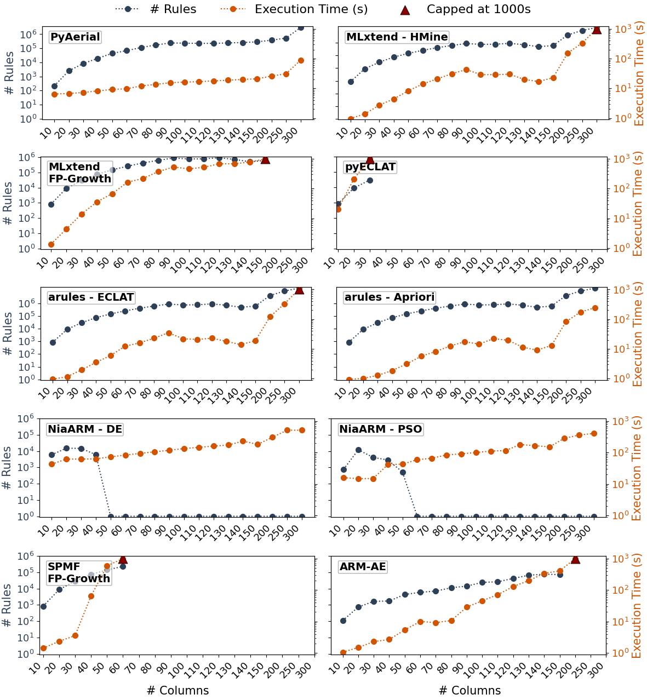

PyAerial Documentation
======================

Welcome to PyAerial's documentation!

PyAerial is a Python implementation of the **Aerial** scalable neurosymbolic association rule miner for tabular data.

It aims to learn a small set of high-quality rules as opposed to exhaustive rule miners such as Apriori, FP-Growth, ECLAT etc. This is done by learning
a neural (network) represantation of the given table, which captures only the most prominent patterns, and then the rules are extracted from the neural representation.

Learn more about the architecture, training, and rule extraction in the paper:
`Neurosymbolic Association Rule Mining from Tabular Data <https://proceedings.mlr.press/v284/karabulut25a.html>`_ (NeSy 2025),
or in the `How Aerial Works <research.html>`_ page.

Performance
-----------

PyAerial significantly outperforms traditional ARM methods in **scalability**, also on CPU, while maintaining high-quality results:

*Execution time comparison across datasets of varying sizes. PyAerial scales linearly while traditional methods (e.g., Mlxtend, SPMF) exhibit exponential growth.*

**Key advantages:**

- ⚡ **100-1000x faster** on large datasets compared to Apriori/FP-Growth Python implementations
- 📈 **Linear scaling** in training, polynomial scaling in rule extraction
- 🎯 **No rule explosion** - extracts concise, high-quality rules with full data coverage
- 💾 **Memory efficient** - neural representation avoids storing exponential candidate sets
- 🖥️ **Fast on CPU** - GPU is optional and only needed for very large datasets

For comprehensive benchmarks and comparisons with Mlxtend (e.g., FPGrowth, Apriori etc.), and other ARM tools, see our benchmarking paper:
`PyAerial: Scalable association rule mining from tabular data <https://www.sciencedirect.com/science/article/pii/S2352711025003073>`_ (SoftwareX, 2025).

.. toctree::
   :maxdepth: 2
   :caption: Contents:

   getting_started
   user_guide
   parameter_guide
   configuration
   api_reference
   research
   citation

Release Notes
-------------

See `GitHub Releases <https://github.com/DiTEC-project/pyaerial/releases>`_ for the full version history and release notes.

Indices and tables
==================

* :ref:`genindex`
* :ref:`modindex`
* :ref:`search`
