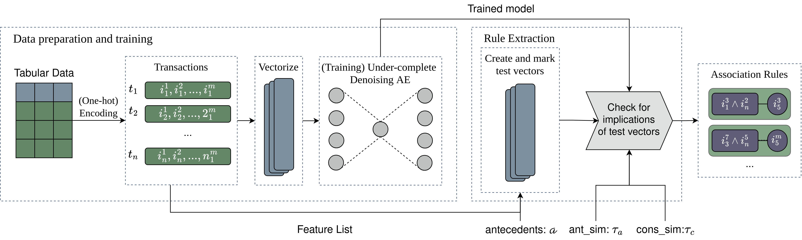
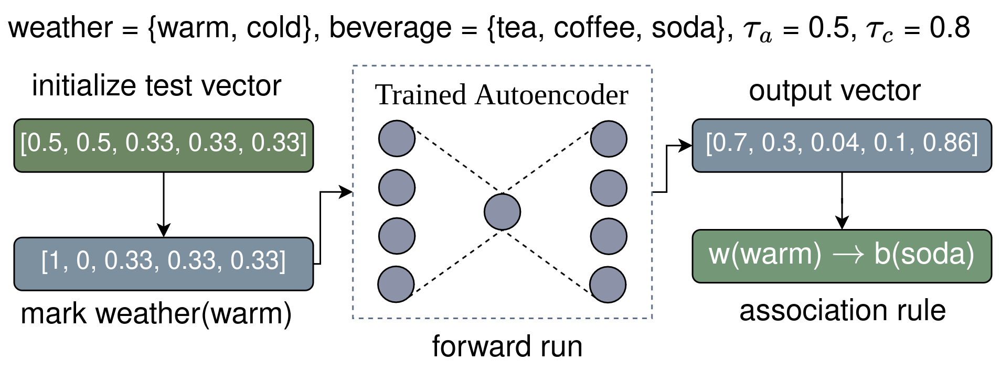

# How Aerial Works

## Introduction

Aerial is a **scalable neurosymbolic association rule mining (ARM) method** for tabular data.

It addresses the **rule explosion** and **execution time** issues in classical ARM by combining:

- **Autoencoder-based neural representation** of tabular data
- **Rule extraction** from learned neural embeddings

Learn more about the architecture, training, and rule extraction in our paper:
[Neurosymbolic Association Rule Mining from Tabular Data](https://proceedings.mlr.press/v284/karabulut25a.html)

## Pipeline Overview

The figure below shows the pipeline of operations for Aerial in 3 main stages.

### 1. Data Preparation

1. Tabular data is first one-hot encoded. This is done using `data_preparation.py:_one_hot_encoding_with_feature_tracking()`.
2. One-hot encoded values are then converted to vector format in the `model.py:train()`.
3. If the tabular data contains numerical columns, they are pre-discretized as exemplified in [Running Aerial for numerical values](user_guide.md#5-running-aerial-for-numerical-values).

### 2. Training Stage

1. An under-complete Autoencoder with either default automatically-picked number of layers and dimension (based on the dataset size and dimension) is constructed, or user-specified layers and dimension. (see [AutoEncoder](api_reference.md#autoencoder))
2. All the training parameters can be customized including number of epochs, batch size, learning rate etc. (see [train() function](api_reference.md#train))
3. An Autoencoder is then trained with a **masking mechanism** to learn associations between input features: each batch
   randomly corrupts a subset of features to a uniform "unknown" distribution, and the Autoencoder learns to reconstruct
   them from the remaining unmasked features. This is an improvement over the Gaussian-noise-based denoising mechanism
   described in the original [paper](https://proceedings.mlr.press/v284/karabulut25a.html) — masking mirrors the
   antecedent → consequent query pattern used during rule extraction more directly than noise injection does. The full
   original Autoencoder architecture is given in the paper.

### 3. Rule Extraction Stage

1. Association rules are then extracted from the trained Autoencoder using Aerial's rule extraction algorithm (see [rule_extraction.py:generate_rules()](api_reference.md#generate_rules)). Below figure shows an example rule extraction process.

2. **Example**. Assume `weather` and `beverage` are features with categories `{cold, warm}` and `{tea, coffee, soda}` respectively.

   The first step is to initialize a test vector of size 5 corresponding to 5 possible categories with equal probabilities per feature, `[0.5, 0.5, 0.33, 0.33, 0.33]`. Then we mark `weather(warm)` by assigning 1 to `warm` and 0 to `cold`, `[1, 0, 0.33, 0.33, 0.33]`, and call the resulting vector a *test vector*.

   Assume that after a forward run, `[0.7, 0.3, 0.04, 0.1, 0.86]` is received as the output probabilities. Since the probability of `p_weather(warm) = 0.7` is bigger than the given antecedent similarity threshold (`τ_a = 0.5`), and `p_beverage(soda) = 0.86` probability is higher than the consequent similarity threshold (`τ_c = 0.8`), we conclude with `weather(warm) → beverage(soda)`.

   

3. For antecedents with more than one feature value, frequency is estimated with a pairwise joint-probability
   approximation (geometric mean of pairwise implication probabilities from the single-feature-value forward runs)
   rather than checking each feature value's frequency independently — a more conservative estimate that better
   reflects actual feature value co-occurrence.

4. Antecedent combinations are searched with an FP-Growth-style growth strategy: feature values are ordered by
   descending frequency, and only combinations whose estimated frequency passes `min_rule_frequency` are extended
   with further feature values. Aerial+ replaces the counting operation of classical ARM with the Autoencoder's
   implication probabilities, so in principle the search strategy of any rule miner can run on top of it — PyAerial
   adopts FP-Growth's, as it is among the fastest. As a result, the number of forward runs is proportional to the
   number of frequent antecedent combinations rather than all possible combinations, and `max_antecedents=None` is
   supported: the search stops on its own once no combination passes the frequency threshold.

5. Frequent itemsets (instead of rules) can also be extracted using the same growth strategy ([rule_extraction.py:generate_frequent_itemsets()](api_reference.md#generate_frequent_itemsets)).

6. Quality metrics (support, confidence, coverage, Zhang's metric, lift, conviction, Yule's Q, interestingness, leverage) are calculated automatically during rule extraction using optimized batch processing with optional parallelization support.

## How PyAerial Improves on Aerial+

PyAerial implements the Aerial+ paper with the following improvements:

- **Masking-based training**: replaces the Gaussian-noise-based denoising of the paper; masking mirrors the
  antecedent → consequent query pattern used during rule extraction (see the Training Stage above).
- **Pairwise frequency estimation**: joint antecedent frequency is estimated from pairwise implication probabilities
  instead of checking each feature value independently.
- **FP-Growth-style rule extraction**: since Aerial+ only approximates the counting operation, any rule miner's search
  strategy can be layered on top of the trained Autoencoder; PyAerial uses FP-Growth's — among the fastest rule
  miners — making rule extraction scale with the number of frequent antecedent combinations and enabling unlimited
  antecedents.

## Key Features

PyAerial provides a comprehensive toolkit for association rule mining with advanced capabilities:

- **Scalable Rule Mining** - Efficiently mine association rules from large tabular datasets without rule explosion
- **Frequent Itemset Mining** - Generate frequent itemsets using the same neural approach
- **ARM with Item Constraints** - Focus rule mining on specific features of interest
- **Classification Rules** - Extract rules with target class labels for interpretable inference
- **Numerical Data Support** - Built-in discretization methods (equal-frequency, equal-width)
- **Customizable Architectures** - Fine-tune autoencoder layers and dimensions for optimal performance
- **GPU Acceleration** - Leverage CUDA for faster training on large datasets
- **Quality Metrics** - Comprehensive rule evaluation (support, confidence, coverage, Zhang's metric)
- **Rule Visualization** - Integrate with NiaARM for scatter plots and visual analysis
- **Flexible Training** - Adjust epochs, learning rate, batch size, and the masking window (min/max unmasked features)
