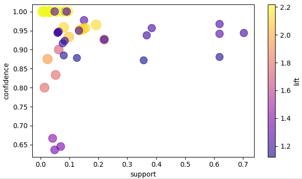

# User Guide

This section provides detailed examples of using Aerial with various configurations and use cases.

> **📝 Note on Parameter Names:** The parameters `min_rule_frequency` and `min_rule_strength` correspond to
`ant_similarity` and `cons_similarity` in the original [Aerial](https://proceedings.mlr.press/v284/karabulut25a.html)
> and [PyAerial](https://doi.org/10.1016/j.softx.2025.102341) papers.

> **🖥️ CPU Performance:** PyAerial runs fast on CPU. GPU acceleration is optional and only beneficial for very large
> datasets.

**Looking for something specific?**

- 🎯 **Parameter tuning** - See the [Parameter Tuning Guide](parameter_guide.md) for how to get high/low support,
  confidence, etc.
- ⚙️ **Configuration** - See [Configuration](configuration.md) for GPU usage, logging, and training parameters
- 🔧 **Troubleshooting** - See [Debugging](configuration.md#debugging) if Aerial can't learn rules or takes too long

## 1. Association Rule Mining from Categorical Tabular Data

```python
from aerial import model, rule_extraction
from ucimlrepo import fetch_ucirepo

# load a categorical tabular dataset from the UCI ML repository
breast_cancer = fetch_ucirepo(id=14).data.features

# train an autoencoder on the loaded table
trained_autoencoder = model.train(breast_cancer)

# extract association rules with quality metrics calculated automatically
result = rule_extraction.generate_rules(trained_autoencoder, min_rule_frequency=0.1, min_rule_strength=0.8)

# access rules and statistics
if len(result['rules']) > 0:
    print(result['statistics'])
    print(result['rules'][0])
```

Following is the partial output of above code:

```
>>> Output:
breast_cancer dataset:
     age menopause tumor-size inv-nodes  ... deg-malig  breast breast-quad irradiat
0  30-39   premeno      30-34       0-2  ...         3    left    left_low       no
1  40-49   premeno      20-24       0-2  ...         2   right    right_up       no
2  40-49   premeno      20-24       0-2  ...         2    left    left_low       no
                                         ...

Overall statistics: {
   "rule_count": 15,
   "average_support": 0.448,
   "average_confidence": 0.881,
   "average_coverage": 0.860,
   "data_coverage": 0.923,
   "average_zhangs_metric": 0.318
}

Sample rule:
{
   "antecedents": [
      {"feature": "inv-nodes", "value": "0-2"}
   ],
   "consequent": {"feature": "node-caps", "value": "no"},
   "support": 0.702,
   "confidence": 0.943,
   "zhangs_metric": 0.69,
   "rule_coverage": 0.744
}
```

**Working with rules:**

Rules are returned in a structured dictionary format with quality metrics included:

```python
# Accessing rule components and quality metrics
for rule in result['rules']:
    # Access antecedent features
    for ant in rule['antecedents']:
        feature_name = ant['feature']  # e.g., "inv-nodes"
        feature_value = ant['value']  # e.g., "0-2"

    # Access consequent
    cons_feature = rule['consequent']['feature']  # e.g., "node-caps"
    cons_value = rule['consequent']['value']  # e.g., "no"

    # Access quality metrics (automatically calculated)
    support = rule['support']
    confidence = rule['confidence']
    zhangs_metric = rule['zhangs_metric']
    rule_coverage = rule['rule_coverage']  # antecedent support
```

> **🔁 Reproducibility:** PyAerial may produce slightly different rules across runs due to the neural network training
> process. To get the same results every time, set a fixed seed before training:
> ```python
> import torch
> torch.manual_seed(42)
> ...
> trained_autoencoder = model.train(breast_cancer)
> ```
> If using GPU, also add:
> ```python
> torch.cuda.manual_seed(42)
> torch.backends.cudnn.deterministic = True
> torch.backends.cudnn.benchmark = False
> ```

## 2. Specifying Item Constraints

Instead of performing rule extraction on all features, Aerial allows you to extract rules only for features of interest.
This is called ARM with item constraints.

In ARM with item constraints, the antecedent side of the rules will contain the items of interest. However, the
consequent side of the rules may still contain other feature values (to restrict the consequent side as well,
see [Using Aerial for Rule-Based Classification](#7-using-aerial-for-rule-based-classification-for-interpretable-inference)).

`features_of_interest` parameter of `generate_rules()` can be used to do that (also valid for
`generate_frequent_itemsets()`, see below).

```python
from aerial import model, rule_extraction
from ucimlrepo import fetch_ucirepo

# categorical tabular dataset
breast_cancer = fetch_ucirepo(id=14).data.features

trained_autoencoder = model.train(breast_cancer)

# features of interest, either a feature with its all values (e.g., "age") or with its certain values (e.g., premeno value of menopause feature is the only feature value of interest)
features_of_interest = ["age", "tumor-size", "inv-nodes", {"menopause": 'premeno'}, "node-caps"]

result = rule_extraction.generate_rules(trained_autoencoder, features_of_interest, min_rule_frequency=0.1)
```

The output rules will only contain features of interest on the antecedent side:

```
>>> Output:
result['rules']: [
   {
      "antecedents": [
         {"feature": "menopause", "value": "premeno"}
      ],
      "consequent": {"feature": "node-caps", "value": "no"},
      "support": 0.357,
      "confidence": 0.68,
      "zhangs_metric": -0.066,
      "rule_coverage": 0.525
   },
   {
      "antecedents": [
         {"feature": "menopause", "value": "premeno"}
      ],
      "consequent": {"feature": "breast", "value": "right"},
      "support": 0.245,
      "confidence": 0.72,
      "zhangs_metric": 0.124,
      "rule_coverage": 0.525
   },
   ...
]
```

## 3. Setting Aerial Parameters

Aerial has 3 key parameters that control rule extraction:

- **`min_rule_frequency`**: Controls support (how frequent patterns are) - analogous to minimum support in traditional
  ARM
- **`min_rule_strength`**: Controls confidence and association strength - analogous to minimum confidence
- **`max_antecedents`**: Maximum number of conditions in rule antecedents (complexity)

**Quick example:**

```python
from aerial import model, rule_extraction
from ucimlrepo import fetch_ucirepo

breast_cancer = fetch_ucirepo(id=14).data.features
trained_autoencoder = model.train(breast_cancer)

# Adjust parameters to control rule characteristics
result = rule_extraction.generate_rules(
    trained_autoencoder,
    min_rule_frequency=0.5,  # Synonymous to minimum antecedent support threshold
    min_rule_strength=0.8,  # Synonymous to minimum confidence/association threshold
    max_antecedents=2  # Max rule length
)
```

**Want to know which parameters to set for your specific needs?**

See the **[Parameter Tuning Guide](parameter_guide.md)** for detailed guidance on:

- Getting high/low support rules
- Getting high/low confidence rules
- Controlling the number of rules
- Common scenarios with examples

## 4. Fine-tuning Autoencoder Architecture and Dimensions

Aerial uses an under-complete Autoencoder and in default, it decides automatically how many layers to use and the
dimensions of each layer (see [API Reference](api_reference.md)).

Alternatively, you can specify the number of layers and dimensions in the `train` method to improve performance.

```python
from aerial import model, rule_extraction, rule_quality

...
# layer_dims=[4, 2] specifies that there are gonna be 2 hidden layers with the dimensions 4 and 2, for encoder and decoder
trained_autoencoder = model.train(breast_cancer, layer_dims=[4, 2])
...
```

In general, lower number of parameters (layers and dimensions) leads to fewer but higher-quality rules. Introduce more
parameters
when not getting enough or no rules, or reduce parameters if the rules are too many and have very low support.

Training longer with the `epochs` parameter of the `train()` function also has similar impact on the final rule set as
increasing
the number of parameters.

## 5. Running Aerial for Numerical Values

Discretizing numerical values is required before running Aerial. PyAerial provides several discretization methods as
part of the `discretization.py` module. These methods can be categorized into **unsupervised** (no target variable
needed) and **supervised** (require target variable for classification tasks).

**Automatic Column Filtering**: All discretization methods automatically skip columns that are already discrete or
categorical-like. This includes:

- Binary columns (e.g., 0/1 for class labels)
- Low-cardinality columns (< 5% unique values relative to total rows)
- Columns with fewer unique values than the requested number of bins

When columns are skipped, an INFO-level log message will indicate which columns were filtered and why.

### 5.1. Unsupervised Discretization Methods

These methods work without requiring a target variable:

#### Equal-Frequency Discretization (Quantile-Based)

Divides data into bins with approximately equal number of samples per bin. Useful for skewed distributions.

```python
from aerial import model, rule_extraction, discretization
from ucimlrepo import fetch_ucirepo

iris = fetch_ucirepo(id=53).data.features
iris_discretized = discretization.equal_frequency_discretization(iris, n_bins=3)

trained_autoencoder = model.train(iris_discretized, epochs=10)
result = rule_extraction.generate_rules(trained_autoencoder, min_rule_frequency=0.1, min_rule_strength=0.8)
print(f"Found {result['statistics']['rule_count']} rules")
```

#### Equal-Width Discretization

Divides the range of values into equal-width intervals. Simple and intuitive.

```python
iris_discretized = discretization.equal_width_discretization(iris, n_bins=5)
```

#### K-Means Discretization

Uses k-means clustering to create bins based on natural clusters in the data. Interval boundaries are created at the
midpoints between consecutive cluster centers.

```python
iris_discretized = discretization.kmeans_discretization(iris, n_bins=4, random_state=42)
```

#### Quantile Discretization

Similar to equal-frequency but allows custom percentile specification.

```python
# Using custom percentiles (quartiles)
iris_discretized = discretization.quantile_discretization(
    iris,
    percentiles=[0, 25, 50, 75, 100]
)
```

#### Custom Bins Discretization

Allows full control with user-specified bin edges for each feature.

```python
bins_dict = {
    'sepal length (cm)': [4.0, 5.0, 6.0, 7.0, 8.0],
    'sepal width (cm)': [2.0, 2.5, 3.0, 3.5, 5.0],
    'petal length (cm)': [1.0, 2.0, 4.0, 5.5, 7.0],
    'petal width (cm)': [0.0, 0.5, 1.5, 2.0, 3.0]
}
iris_discretized = discretization.custom_bins_discretization(iris, bins_dict)
```

### 5.2. Supervised Discretization Methods

These methods use target variable information to create more informative bins for classification:

#### Entropy-Based Discretization (MDLP)

Uses decision tree splits to minimize entropy with respect to the target variable.

```python
from aerial import discretization
from ucimlrepo import fetch_ucirepo

# Load dataset with target labels
iris_data = fetch_ucirepo(id=53)
features = iris_data.data.features
targets = iris_data.data.targets

import pandas as pd

df = pd.concat([features, targets], axis=1)

# Discretize using target information
df_discretized = discretization.entropy_based_discretization(df, target_col='class', n_bins=4)
```

#### ChiMerge Discretization

Merges adjacent intervals based on chi-square statistics to find optimal discretization.

```python
df_discretized = discretization.chimerge_discretization(
    df,
    target_col='class',
    max_bins=5,
    significance_level=0.05
)
```

#### Decision Tree Discretization

Uses decision tree regression to find optimal split points based on the target variable. Works with both categorical and
numerical targets.

```python
df_discretized = discretization.decision_tree_discretization(
    df,
    target_col='class',
    max_depth=3,
    min_samples_leaf=5
)
```

Following is the partial iris dataset content before and after the discretization:

```
>>> Output:
# before discretization
   sepal length  sepal width  petal length  petal width
0           5.1          3.5           1.4          0.2
1           4.9          3.0           1.4          0.2
...

# after discretization
  sepal length  sepal width  petal length   petal width
0  (5.0, 5.27]  (3.4, 3.61]  (0.999, 1.4]  (0.099, 0.2]
1   (4.8, 5.0]   (2.8, 3.0]  (0.999, 1.4]  (0.099, 0.2]
...
```

## 6. Frequent Itemset Mining with Aerial

Aerial can also be used for frequent itemset mining besides association rules.

```python
from aerial import model, rule_extraction, rule_quality
from ucimlrepo import fetch_ucirepo

# categorical tabular dataset
breast_cancer = fetch_ucirepo(id=14).data.features
trained_autoencoder = model.train(breast_cancer, epochs=5, lr=1e-3)

# extract frequent itemsets with support values calculated automatically
result = rule_extraction.generate_frequent_itemsets(trained_autoencoder)

# access itemsets and statistics
print(f"Found {result['statistics']['itemset_count']} itemsets")
print(f"Average support: {result['statistics']['average_support']}")
```

The following is a sample output:

```
>>> Output:

Found 15 itemsets
Average support: 0.295

Itemsets with support values:
[
   {
      'itemset': [{'feature': 'menopause', 'value': 'premeno'}],
      'support': 0.524
   },
   {
      'itemset': [{'feature': 'menopause', 'value': 'ge40'}],
      'support': 0.451
   },
   {
      'itemset': [{'feature': 'menopause', 'value': 'premeno'}, {'feature': 'age', 'value': '30-39'}],
      'support': 0.312
   },
   ...
]
```

## 7. Using Aerial for Rule-Based Classification for Interpretable Inference

Aerial can be used to learn rules with a class label on the consequent side, which can later be used for inference
either by themselves or as part of rule list or rule set classifiers (e.g.,
from [imodels](https://github.com/csinva/imodels) repository).

This is done by setting `target_classes` parameter of the `generate_rules` function. This parameter refers to the class
label(s) column of the tabular data.

As shown in [Specifying Item Constraints](#2-specifying-item-constraints), we can also specify multiple target classes
and/or their specific values. `["Class1", {"Class2": "value2"}]` array specifies that we are interested in all values of
`Class1` and specifically `value2` of `Class2` in the consequent side of the rules.

```python
import pandas as pd
from aerial import model, rule_extraction, rule_quality
from ucimlrepo import fetch_ucirepo

# categorical tabular dataset
breast_cancer = fetch_ucirepo(id=14)
labels = breast_cancer.data.targets
breast_cancer = breast_cancer.data.features

# merge labels column with the actual table
table_with_labels = pd.concat([breast_cancer, labels], axis=1)

trained_autoencoder = model.train(table_with_labels)

# generate rules with a target class(es), this learns rules that has the "target_classes" column (in this case this column is called "Class") on the consequent side
result = rule_extraction.generate_rules(trained_autoencoder, target_classes=["Class"], min_rule_strength=0.5)

if len(result['rules']) > 0:
    print(f"Generated {result['statistics']['rule_count']} classification rules")
    print(f"Average confidence: {result['statistics']['average_confidence']}")
```

Sample output showing rules with class labels on the right hand side:

```
>>> Output:

Generated 12 classification rules
Average confidence: 0.742

Sample rule:
{
   "antecedents": [
      {"feature": "menopause", "value": "premeno"}
   ],
   "consequent": {"feature": "Class", "value": "no-recurrence-events"},
   "support": 0.357,
   "confidence": 0.68,
   "zhangs_metric": -0.066,
   "rule_coverage": 0.525
}
```

## 8. Smart Defaults and Filtering

Aerial uses smart defaults when you don't know what values to use.

### 8.1. Training Duration

By default, Aerial uses `epochs=2` which produces fewer, higher-quality rules:

```python
trained_autoencoder = model.train(breast_cancer)  # epochs=2 by default
```

**Why shorter training is better:**

- Captures only the strongest associations
- Produces fewer, higher-quality rules
- Avoids overfitting to noise

**When to increase epochs:**

- Only if you're getting no rules and suspect underfitting
- Start with `epochs=3` or `epochs=5` and observe results

### 8.2. Automatic Batch Size

Batch size is now automatically determined based on dataset size when not specified:

```python
# Batch size is auto-selected based on number of rows
trained_autoencoder = model.train(breast_cancer)  # batch_size chosen automatically
```

**Auto-selection logic:**

- <200 rows: batch_size=2
- <500 rows: batch_size=4
- <1000 rows: batch_size=8
- <5000 rows: batch_size=32
- ≥5000 rows: batch_size=64

### 8.3. Filtering Rules by Quality

Post-filter rules to keep only those meeting quality thresholds:

```python
result = rule_extraction.generate_rules(
    trained_autoencoder,
    min_confidence=0.7,
    min_support=0.1
)
```

**Parameters:**

- `min_confidence`: Keep only rules with confidence ≥ this value
- `min_support`: Keep only rules with support ≥ this value

**Use when:**

- You want to filter results without changing the extraction thresholds, and to avoid false positives
- You want only high-confidence or high-support rules

### 8.4. Combining Parameters

Filtering works with all other parameters:

```python
result = rule_extraction.generate_rules(
    trained_autoencoder,
    target_classes=["Class"],
    features_of_interest=["age"],
    min_confidence=0.6,
    max_antecedents=2
)
```

## 9. Visualizing Association Rules

Rules learned by PyAerial can be visualized using [NiaARM](https://github.com/firefly-cpp/NiaARM) library. In the
following, `visualizable_rule_list()` function converts PyAerial's rule format to NiaARM `RuleList()` format. And then
visualizes the rules on a scatter plot using the visualization module of NiaARM

```python
...
from niaarm.visualize import scatter_plot
from niaarm import RuleList, Feature, Rule


def visualizable_rule_list(aerial_result: dict, dataset: pd.DataFrame):
    rule_list = RuleList()
    for rule in aerial_result['rules']:
        # Convert dictionary format to NiaARM Feature format
        antecedents = [Feature(ant['feature'], "cat", categories=[ant['value']]) for ant in rule["antecedents"]]
        consequent = Feature(rule["consequent"]['feature'], "cat", categories=[rule["consequent"]['value']])
        rule_list.append(Rule(antecedents, [consequent], transactions=dataset))
    return rule_list


# learn rules with PyAerial as before
breast_cancer = fetch_ucirepo(id=14).data.features
trained_autoencoder = model.train(breast_cancer)
result = rule_extraction.generate_rules(trained_autoencoder, min_rule_frequency=0.1)

# get rules in NiaARM RuleList format
visualizable_rules = visualizable_rule_list(result, breast_cancer)
figure = scatter_plot(rules=visualizable_rules, metrics=('support', 'confidence', 'lift'), interactive=False)
figure.show()
```

Visualization of the PyAerial rules as a scatter plot showing their quality metrics:



Please see NiaARM for more visualization options: https://github.com/firefly-cpp/NiaARM?tab=readme-ov-file#visualization
